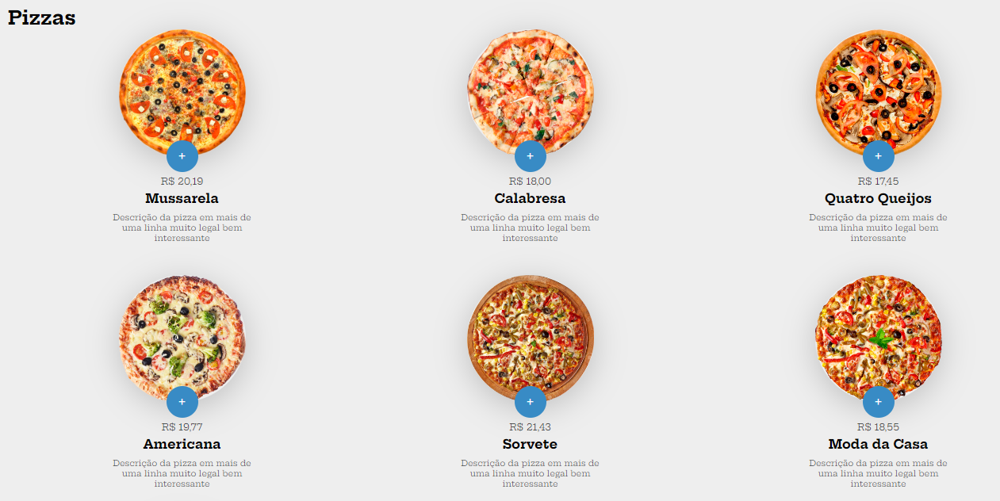
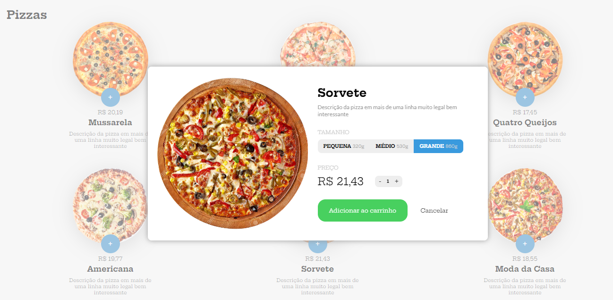
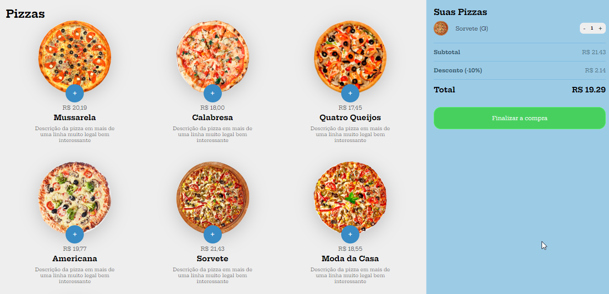

##  Loja de Pizzas
### Esse projeto é uma atividade prática desenvolvida no curso de JavaScript da [B7web](https://alunos.b7web.com.br/curso/javascript/compra-de-pizzas-parte-1) 
 

  </img>

  </img>

  </img>

 

### Tecnologias utilizadas:

 

  
  
  

 

### Visualização do projeto: 

- [Pizzaria](https://pizzaria-b7web.netlify.app/)
